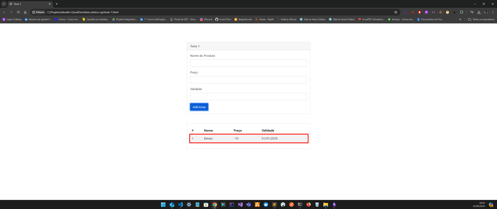
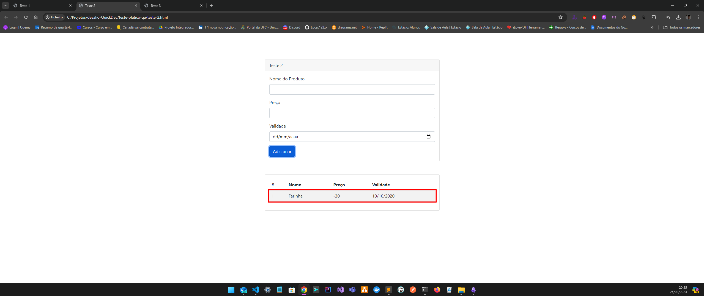
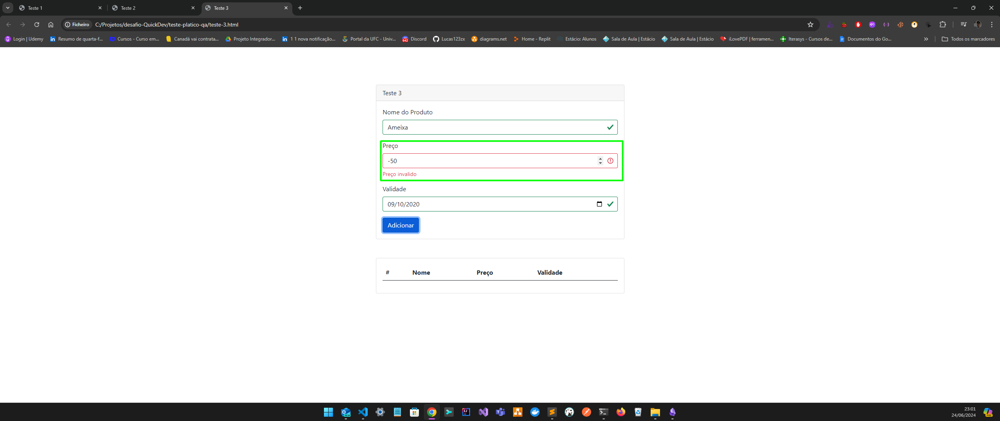

# desafio-QuickDev
Repositorio voltado a responder desafios da QuickDev na segunda fase do processo seletivo.

#### Projeto node pacotes instalados:

- [Cypress](https://www.cypress.io/) 
- [Cucumber Preprocessor](https://github.com/badeball/cypress-cucumber-preprocessor)
- [Multiple Cucumber HTML Reporter](https://www.npmjs.com/package/multiple-cucumber-html-reporter)
- [Concurrently](https://www.npmjs.com/package/concurrently)
- [Http-server](https://www.npmjs.com/package/http-server)
- [Kill-port](https://www.npmjs.com/package/kill-port)
- [Cypress-xpath](https://www.npmjs.com/package/cypress-xpath)

---

### Pré-requisistos:
1. Clonar Projeto `git clone git@github.com:Lucas123zx/desafio-QuickDev.git`
2. Arquivos do desafio presente na raíz do projeto 
3. Execute o comando `npm install` no terminal da ide para baixa os pacotes node
4. Criar arquivo `cypress.env.json` variavel de ambiente
  
Dados do artefato a ser testado presenta no caminho

/home/my-disc/my-project/desafio-QuickDev

    └── teste-pratico-qa
      └── Teste Pratico QA - Pleno.pdf
      └── teste-1-html 
      └── teste-2-html
      └── teste-3-html


### Desafio 1: 

CT01_Adicionar produto com valor de preço menor que 0 

**Feature**: Adicionar Produto 

**Scenario**: Adicionar produto valor de preço menor que 0

 **Dado** que o usuario esteja na tela de cadastro de produto

 **Quando** o usuario preencher os dados de cadastro do produto

 **E** preencher campo preco com um valor negativo

 **E** adicionar produto

 **Entao** o usuario deve visualizar a mensagem "Preço invalido" abaixo do campo preco

 **E** o produto nao deve ser adicionado a lista

Tela 1 - Resultado Obtido: 


Tela 2 - Resultado Obtido: 


Tela 3 - Resultado Obtido:


---

### Desafio 2:

1. ferramentas a serem utilizadas: 

- framework cypress
- cucumber preprocesso (sinxta Gherkin)
- report (relatório de testes)
- servidor estático 
- fechar porta do servidor
- xpath para capturar alguns elementos especificos

---
2. técnicas:

-  Padão de projeto POM (Page Object Model)
-  Projeto com váriaveis que permita executa o codigo em diferentes ambientes
-  Identificação de seletores únicos


---

3. passo a passo:
   
- Garantir que arterfato a ser testado está estável o suficente antes de automatiza; 
- Mapear elementos a serem utilizados na automatização;
- Estruturar codigo parametrizado;
- Criar classes para geração de massa de dados que podem ser reutilizadas em outras partes do código;

estrutura do projeto

/home/my-disc/my-project/desafio-QuickDev

    └── cypress
      └── e2e/feature  (pasta aonde ficara os funcionalidade a serem testadas)
      └── reports  (pasta aonde será armazenado os relatórios de teste - aparece toda vez que executa o teste no modo handless)
      └── screenshots (pasta de imagens salvas no momento do teste)
      └── support (pasta de configurações, commands, pages, plugins, steps, util, components)
        └── commands (pasta de commandos personalizados do cypress)
        └── components (pasta de elementos capturados)
        └── pages (pasta de ações)
        └── plugins (pasta de plugins)
        └── steps (pasta de passo e validações)
        └── util (pasta de aqruivos reutilizados)
      └── teste-pratico-qa (pasta que contem o desafio, atefatos e screenshots de testes manuais)
      └── .cypress-cucumber-preprocessorrc.json (configuração do cucumber e relatórios)
      └── cypress.config.js (configuração do cypress)
      └── cypress.env.json (configuração do cypress de variaveis de ambiente)
      └── jsconfig.js (configuração do js para o cypress)

---

### Exemplo Aqruivo `cypress.env.json`
```
  {
    "teste1": {
      "baseUrl": "http://192.168.100.2:8080/teste-pratico-qa/teste-1.html"
    },
    "teste2": {
      "baseUrl": "http://192.168.100.2:8080/teste-pratico-qa/teste-2.html"
    },
    "teste3": {
      "baseUrl": "http://192.168.100.2:8080/teste-pratico-qa/teste-3.html"
    }
  }
```

---

### Execuções: 

-  execute o comando no terminal `npm run teste1-run` executa o teste no modo headless da tela 1 
-  execute o comando no terminal `npm run teste2-run` executa o teste no modo headless da tela 2
-  execute o comando no terminal `npm run teste3-run` executa o teste no modo headless da tela 3
-  execute o comando no terminal `npm run teste1` executa o teste no modo interativo da tela 1
-  execute o comando no terminal `npm run teste2` executa o teste no modo interativo da tela 2
-  execute o comando no terminal `npm run teste3` executa o teste no modo interativo da tela 3


**testes** executados no modo headless será gerado relátorio de teste.

